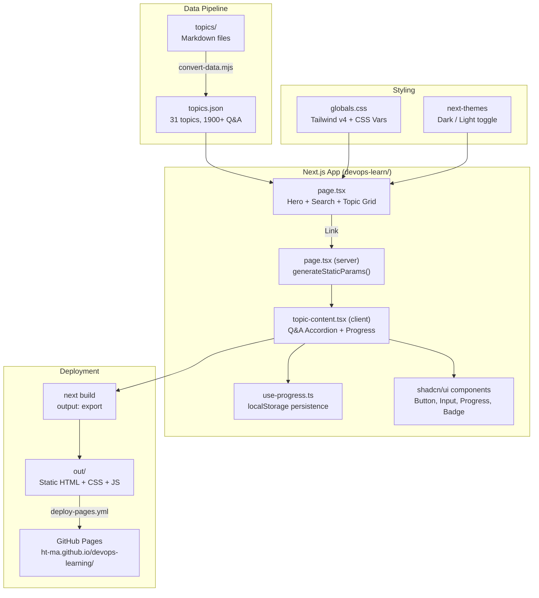

# DevOps Learning Hub

## Overview

DevOps interview prep website built on top of the [devops-exercises](https://github.com/bregman-arie/devops-exercises) data set.
Extracts 1900+ Q&A from 31 Markdown topic files into a static Next.js site for interview cramming.

- **Target users**: Interview prep - flashcard-style Q&A with progress tracking
- **Deployed to**: GitHub Pages at https://ht-ma.github.io/devops-learning/
- **Source repo**: https://github.com/HT-MA/devops-learning (NOT a fork - independent repo)

## Architecture



## Tech Stack

| Layer | Choice |
|-------|--------|
| Framework | Next.js 16 (App Router + Turbopack) |
| UI | shadcn v4 + Tailwind CSS v4 |
| Animation | framer-motion |
| Theme | next-themes (dark/light, default dark) |
| Fonts | System font stack (no Google Fonts - network-independent build) |

## Key Decisions

1. **Static export** (`output: "export"` in next.config.ts) - no Node.js server needed, works on GitHub Pages
2. **`basePath`** set via `BASE_PATH` env var - must match the GitHub Pages subpath (`/devops-learning`)
3. **System fonts** - removed `next/font/google` to avoid network dependency during builds
4. **Native `<input>`** - replaced `@base-ui/react` InputPrimitive to eliminate hydration mismatch
5. **Server/client split** - `topic/[slug]/page.tsx` is a server component with `generateStaticParams()`, interactive UI lives in `topic-content.tsx`

## Source Files

| File | Purpose |
|------|---------|
| `src/app/page.tsx` | Homepage - hero, search, category filters, topic grid |
| `src/app/topic/[slug]/page.tsx` | Server wrapper with `generateStaticParams()` |
| `src/app/topic/[slug]/topic-content.tsx` | Client component - Q&A accordion, search, shuffle, progress |
| `src/components/navbar.tsx` | Sticky nav - logo, progress count, theme toggle, GitHub link |
| `src/components/topic-card.tsx` | Topic card with color accent bar and progress |
| `src/hooks/use-progress.ts` | localStorage-based completion tracking |
| `src/data/topics.json` | All 31 topics with Q&A (generated by `scripts/convert-data.mjs`) |
| `src/app/globals.css` | Tailwind v4 config, CSS vars, mesh-bg, glass effects |
| `next.config.ts` | Static export config, BASE_PATH from env |
| `.github/workflows/deploy-pages.yml` | Auto-deploy to GitHub Pages on push to master |

## Commands

```bash
cd devops-learn

npm install          # Install dependencies
npm run dev          # Start dev server (default: localhost:3000)
npm run build        # Build static site -> out/
npm run lint         # Run ESLint
```

To build with GitHub Pages basePath:
```bash
BASE_PATH=/devops-learning npm run build
```

## Data Pipeline

The `topics.json` is pre-generated from the Markdown files in `topics/`:

```bash
cd devops-learn
node scripts/convert-data.mjs
```

This reads all topic directories, parses Q&A from Markdown, and outputs `src/data/topics.json` with 31 topics across 14 categories.

## Deployment

Push to `master` triggers `.github/workflows/deploy-pages.yml` which:
1. Installs deps (`npm ci`)
2. Builds with `BASE_PATH=/devops-learning`
3. Deploys `out/` to GitHub Pages

**Important**: Pages must be configured to build from GitHub Actions (not branch).

## Common Issues

- **Hydration mismatch**: If adding UI library components, check for server/client style differences. We fixed this by replacing base-ui's InputPrimitive with a native `<input>`.
- **CSS not loading on GitHub Pages**: Ensure `BASE_PATH` in the workflow matches the actual repo name, and the env var is passed correctly during build.
- **scroll-smooth warning**: Use `data-scroll-behavior="smooth"` on `<html>` instead of CSS `scroll-smooth` class (Next.js compatibility).
- **PowerShell `[slug]` paths**: Use `cmd /c type` or `node` to read/write files in dynamic route directories.